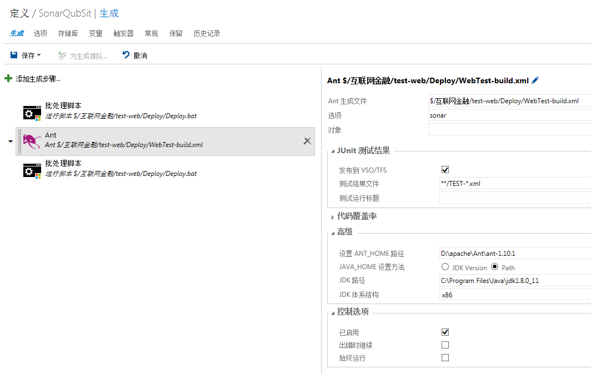
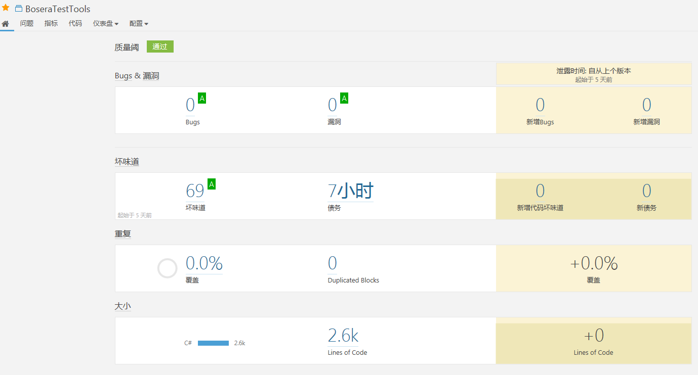
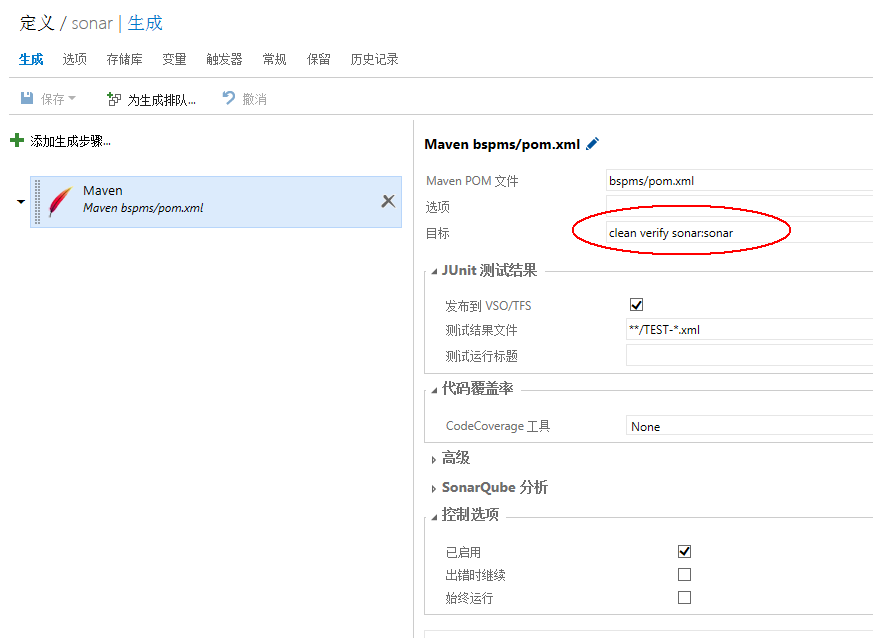
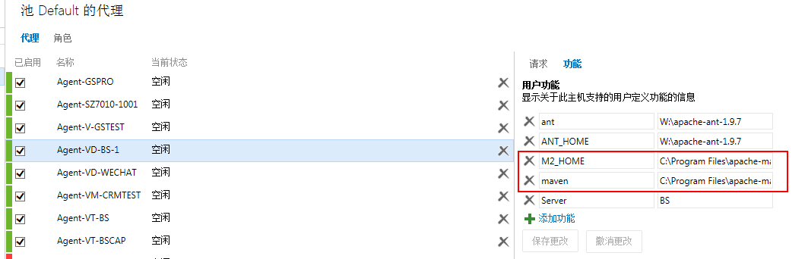
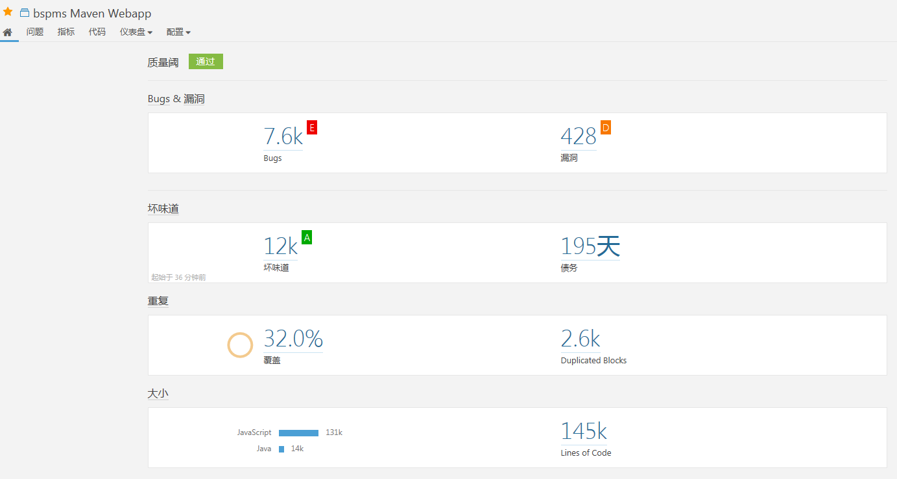
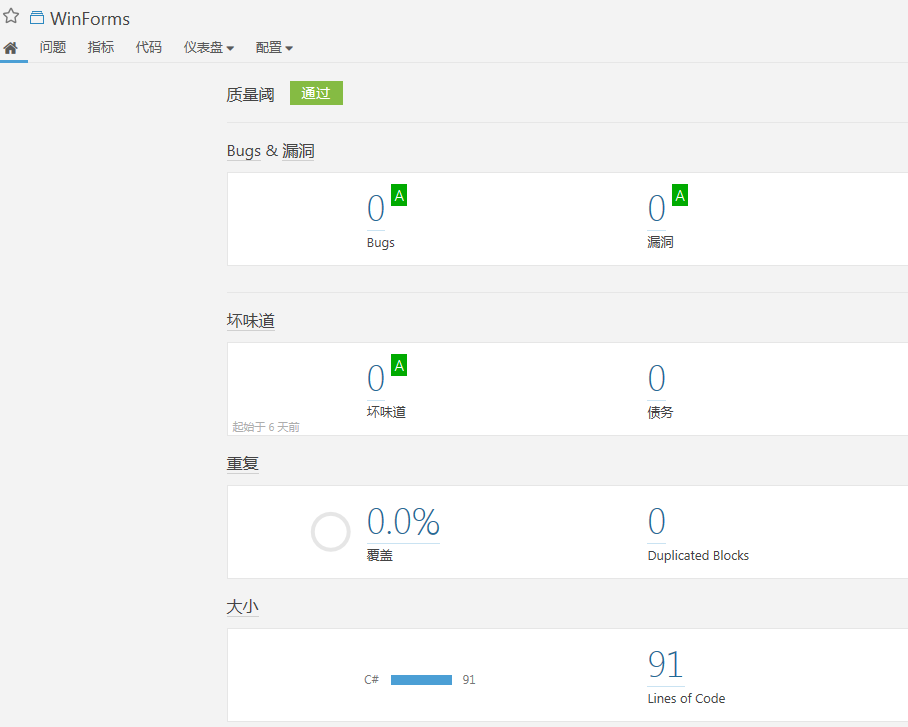

# SonarQube 安装使用手册

## 一、SonarQube Server 安装

SonarQube Server 需要安装在单独的服务器上，提供如下服务：
- build 过程中，Scanner 完成后上传结果
- 用户通过浏览器访问，进行查看，配置，管理等操作

### 1、前置条件

JDK8 已安装
下载地址: http://www.oracle.com/technetwork/java/javase/downloads/index.html

### 2、安装

#### (1) 下载安装包: sonarqube-5.6.6.zip

备注：6.3.1版本检查 C# 语言有严重 bug，暂不使用。

https://www.sonarqube.org/downloads/
解压,放在合适的位置即可，如：D:\SonarQube\sonarqube-5.6.6

#### (2) 下载中文语言包: sonar-l10n-zh-plugin-1.11.jar

备注：SonarQube 各版本对应的中文语言包不同
https://github.com/SonarQubeCommunity/sonar-l10n-zh/releases/tag/sonar-l10n-zh-plugin-1.11
放在 ${SONAR_HOME}\extensions\plugins

### 3、启动

${SONAR_HOME}\bin\windows-x86-64\StartSonar.bat
访问: 127.0.0.1:9000

### 4、关闭

在 CMD 窗口 Ctr+C

## 二、SonarQube Scanner 安装

Scanner 需要安装在执行 build 的机器上，如开发者本机，build 代理机

### 1、Analyzing with SonarQube Scanner for Ant

前提: ant 已经成功安装，配置环境变量如下：
ANT_HOME = D:\apache\Ant\ant-1.10.1
path += ;%ANT_HOME%\bin

#### (1) 安装

下载 sonarqube-ant-task-2.5.jar，放在 ${ANT_HOME}\lib 目录
下载地址：https://docs.sonarqube.org/display/SCAN/Analyzing+with+SonarQube+Scanner+for+Ant

#### (2) 配置代码 build.xml

在 build.xml 中添加如下片段
```xml
<project name="My Project" default="all" basedir="." xmlns:sonar="antlib:org.sonar.ant">
...

<!-- Define the SonarQube global properties (the most usual way is to pass these properties via the command line) -->
<property name="sonar.host.url" value="http://vwt-sonar:80" />
...

<!-- Define the SonarQube project properties -->
<property name="sonar.projectKey" value="WebTeset" />
<property name="sonar.projectName" value="WebTest" />
<property name="sonar.projectVersion" value="1.0" />
<property name="sonar.sources" value="D:\tfst\agent\_work\2\s\Sit\src" />
<property name="sonar.java.binaries" value="build" />
<property name="sonar.java.libraries" value="lib/*.jar" />


<!-- Define SonarQube Scanner for Ant Target -->
<target name="sonar">
	<taskdef uri="antlib:org.sonar.ant" resource="org/sonar/ant/antlib.xml">
		<!-- Update the following line, or put the "sonarqube-ant-task-*.jar" file in your "$HOME/.ant/lib" folder -->
		<classpath path="D:\ant\lib\sonarqube-ant-task-2.5.jar" />
	</taskdef>

	<!-- Execute SonarQube Scanner for Ant Analysis -->
	<sonar:sonar />
</target>
```
- sonar.projectKey: 必须唯一
- sonar.projectName: 项目名称
- sonar.sources: 代理机上的源码路径
- path: sonarqube-ant-task-2.5.jar 路径

#### (3) 在 TFS 上配置 ant 参数

选项：sonar
高级->设置 ANT_HOME 路径：D:\apache\Ant\ant-1.10.1


#### (4) build

等待 build 完成，查看 SonarQube 页面的项目，已产生报告


### 2、Analyzing with SonarQube Scanner for Maven

前提: Maven3.x 已经成功安装，配置环境变量如下：
MAVEN_HOME = D:\apache\Maven\maven-3.5
path += %MAVEN_HOME%\bin

#### (1) 配置 Maven settings.xml

 在 ${MAVEN_HOME}/conf 或者 ~/.m2 目录下，找到 settings.xml 文件，增加以下未注释的片段到相应位置
```xml
<!-- settings>
    <pluginGroups -->
        <pluginGroup>org.sonarsource.scanner.maven</pluginGroup>
    <!-- /pluginGroups>
    <profiles -->
        <profile>
            <id>sonar</id>
            <activation>
                <activeByDefault>true</activeByDefault>
            </activation>
            <properties>
                <sonar.host.url>
                  http://vwt-sonar:80
                </sonar.host.url>
            </properties>
        </profile>
     <!-- /profiles>
</settings -->
```
#### (2) 执行代码检查

- ##### 命令行方式

在  pom.xml 目录打开 cmd 终端，执行命令：
```bash
mvn clean verify sonar:sonar
```
或者
```bash
mvn clean install
mvn sonar:sonar
```

- ##### TFS 生成


代理机上要设置 maven 和 M2_HOME 变量


#### (3) 查看结果

等待 build 完成，查看 SonarQube 页面的项目，已产生报告


### 3、Analyzing with SonarQube Scanner for MSBuild

#### (1) 前提条件

- 已安装 .NET v4.5.2+
- 已安装 JRE8
- 已安装配置了 VS 2015

#### (2) 安装

下载软件包 sonar-scanner-msbuild-2.3.2.573.zip，解压，放在 D:\SonarQube\bin
下载地址：https://github.com/SonarSource/sonar-scanner-msbuild/releases/download/2.3.2.573/sonar-scanner-msbuild-2.3.2.573.zip

#### (3) 配置

 编辑 D:\SonarQube\bin\SonarQube.Analysis.xml
 ```xml
 <Property Name="sonar.host.url">http://vwt-sonar:80</Property>
 <Property Name="sonar.sorceEncoding">UTF-8</Property>
 <!--如果打开了访问权限限制，则需要配置下面这项 ，否则不需要-->
 <Property Name="sonar.login">DFHSHF#@Dfsfdfs</Property>
 ```
在环境变量 path 中添加：D:\SonarQube\bin

#### (4) build
在项目路径下，执行如下 cmd 命令：
```bash
SonarQube.Scanner.MSBuild.exe begin /k:"WinForms" /n:"WinForms" /v:"1.0"
MSBuild.exe /t:Rebuild
SonarQube.Scanner.MSBuild.exe end
```
其中，/k 参数是项目key，必须唯一，/n 参数是项目名称，/v 是版本号

等待 build 完成，查看 SonarQube 页面的项目，已产生报告


#### 问题：
MSbuild 版本可能有问题，需要替换，请用 VWT-SONAR 上的 C:\Program Files (x86)\MSBuild\14.0 替换目标代理机的对应的目录


### 4、Analyzing with SonarQube Scanner

#### (1) 前提条件

- 已安装 JRE8

#### (2) 安装
下载软件包 https://docs.sonarqube.org/display/SCAN/Analyzing+with+SonarQube+Scanner
解压，放在 D:\SonarQube\sonar-scanner

#### (3) 配置
1) 编辑 ./sonar-scanner/conf/sonar-scanner.properties
```python
#----- Default SonarQube server
sonar.host.url=http://vwt-sonar/
```
2) 将 D:\SonarQube\sonar-scanner\bin 添加到环境变量 path 中

3) 在项目目录下创建文件  sonar-project.properties
```python
# must be unique in a given SonarQube instance
sonar.projectKey=my:project
# this is the name and version displayed in the SonarQube UI. Was mandatory prior to SonarQube 6.1.
sonar.projectName=My project
sonar.projectVersion=1.0

# Path is relative to the sonar-project.properties file. Replace "\" by "/" on Windows.
# This property is optional if sonar.modules is set.
sonar.sources=.

# Encoding of the source code. Default is default system encoding
#sonar.sourceEncoding=UTF-8
```

#### (4) 运行
在项目目录下，通过 CMD 运行命令：
```bash
sonar-scanner
```
